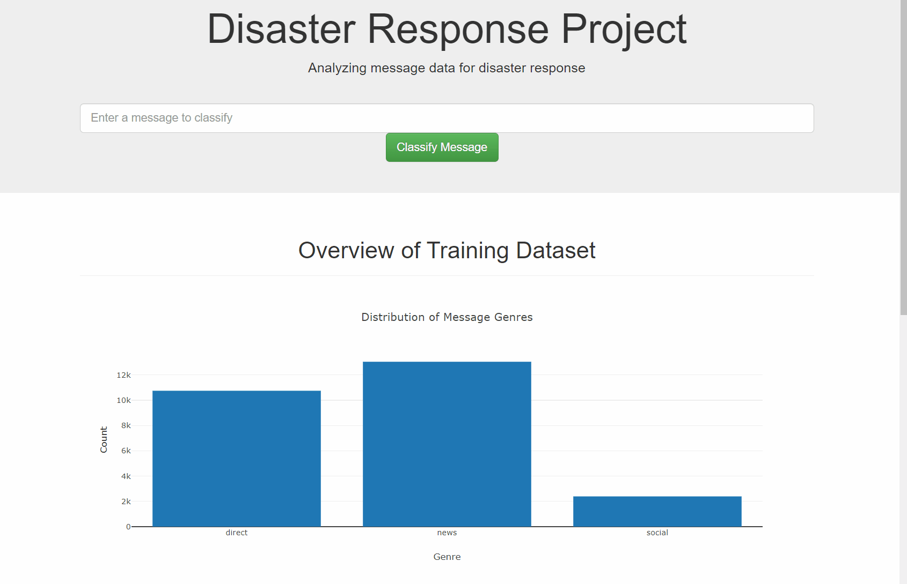

# Disaster Response Pipeline Project

## Project Motivation
In an emergency time is crucial and the rescuers or an organization can be overloaded with the ammount of messages
generated during a crisis. This project uses Machine Learning, in order to read those emergency messages and
categorize them into categories. Therefore, emergency services can prioritize the need and saving time reading the entire message.

The API and frontend developed gives a glimpse of the data contained in a database ad it provide the predictions for
emergency messages as shown below.

 

## Project Requirements

* Python3 with an [Anaconda Distribution](https://www.anaconda.com/products/individual) (recommended)

## Project Structure

    .
    ├── app     
    │   ├── run.py                           # Flask file that runs app
    │   └── templates   
    │       ├── go.html                      # Classification result page of web app
    │       └── master.html                  # Main page of web app    
    ├── data                   
    │   ├── disaster_categories.csv          # Dataset including all the categories  
    │   ├── disaster_messages.csv            # Dataset including all the messages
    │   └── process_data.py                  # Data cleaning
    ├── models
    │   └── train_classifier.py              # Train ML model    
    ├── pipeline_design     
        │   ├── ETL Pipeline Preparation.ipynb   # Design of the ETL Pipeline
        │   └── ML Pipeline Preparation.ipynb    # Design of the ML Pipeline       
    └── README.md

### Instructions:
1. Run the following commands in the project's root directory to set up your database and model.

    - To run ETL pipeline that cleans data and stores in database
        `python data/process_data.py data/disaster_messages.csv data/disaster_categories.csv data/DisasterResponse.db`
    - To run ML pipeline that trains classifier and saves
        `python models/train_classifier.py data/DisasterResponse.db models/classifier.pkl`

2. Run the following command in the app's directory to run your web app.
    `python run.py`

3. Go to http://0.0.0.0:3001/

## Acknowledgements
* Udacity for offering the challenge
* Figure Eith for providing the datasets
